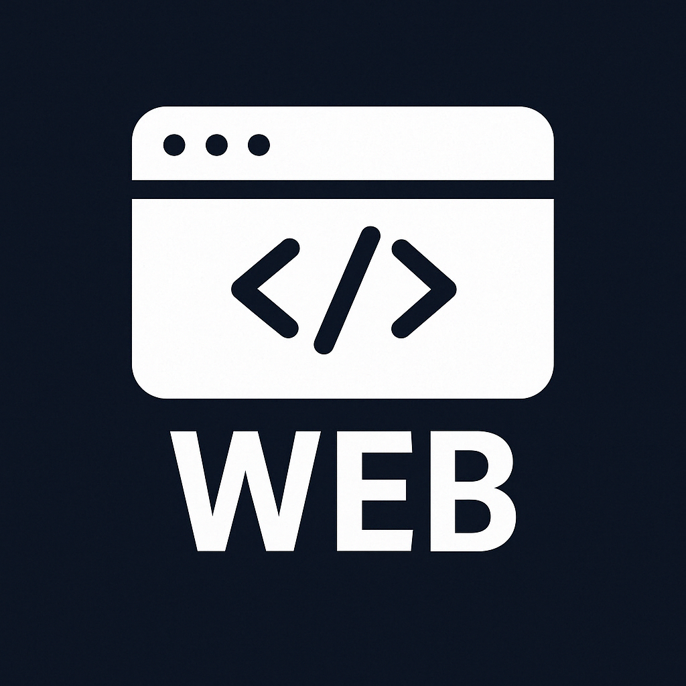
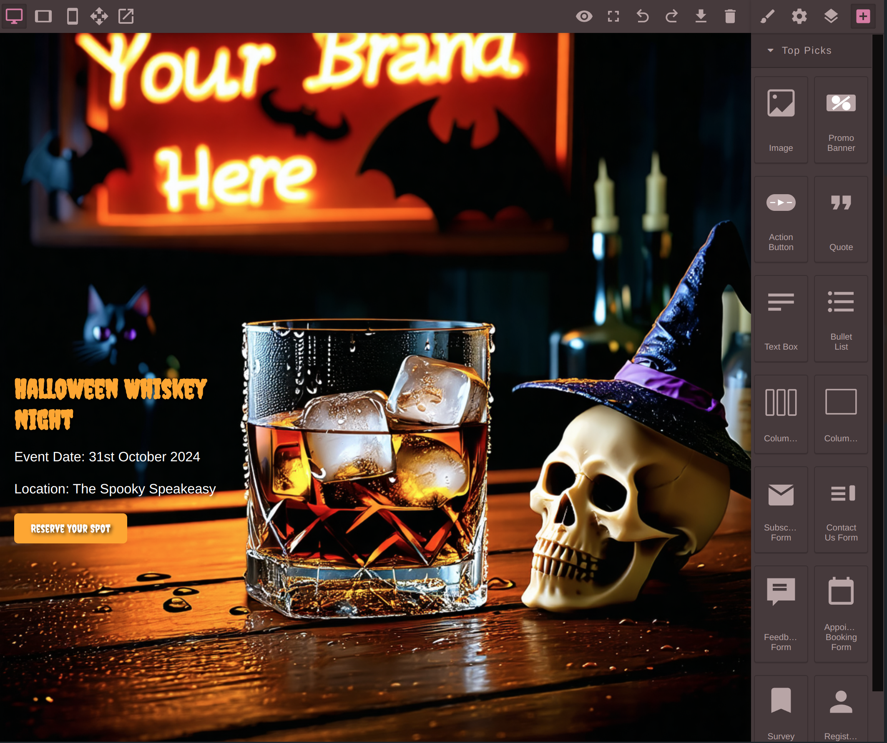
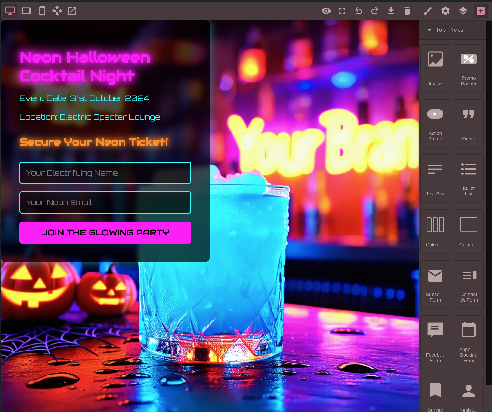
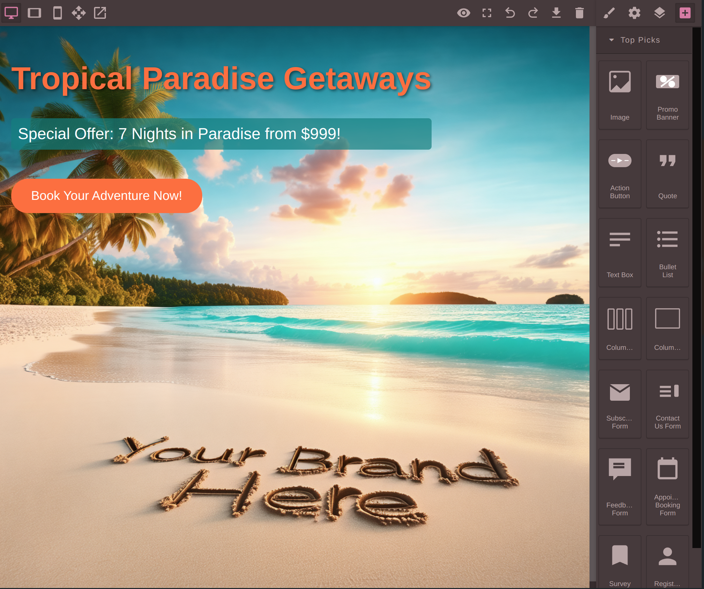
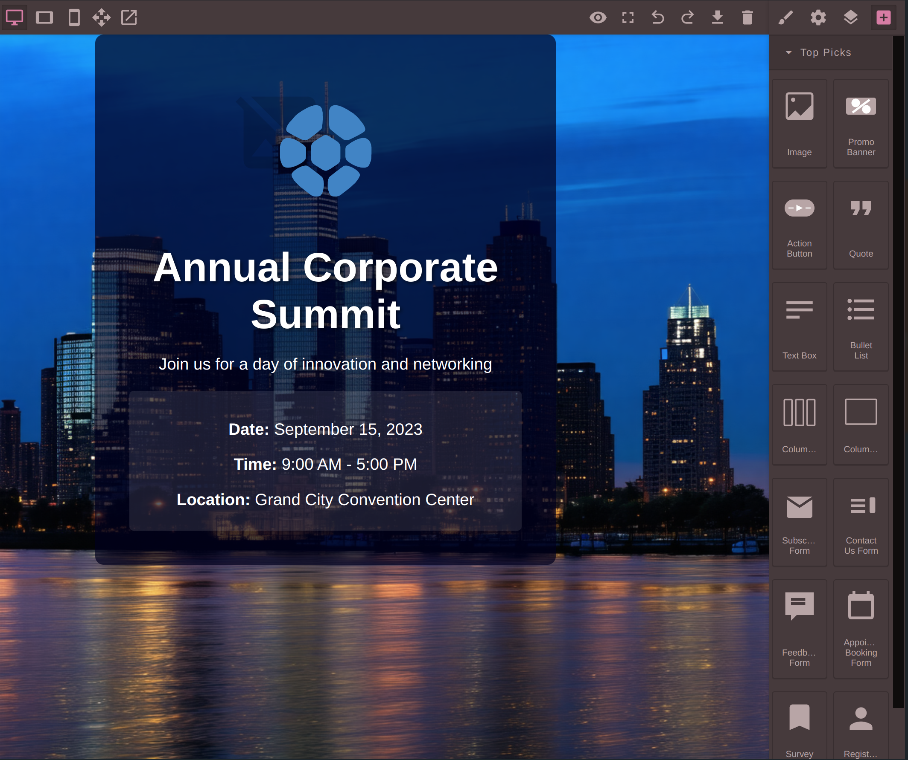

# AI Web Maker &middot; [](https://github.com/open-kbs/ai-web-maker/blob/main/LICENSE)
<table>
  <tr>
    <td>
      
    </td>
    <td>
      <strong>An AI app that creates interactive web pages with forms to collect information from clients, such as survey forms and more.</strong>
    </td>
  </tr>
</table>

<br />

## OpenKBS + GrapesJS = AI Web Maker

<p float="left">
  
   
  
  
   
  
</p>

## Installation Guide

### Step 1: Install OpenKBS CLI and Login

You need to have the OpenKBS CLI installed on your system and Login:

```bash
npm install -g openkbs
openkbs login
```

If you do not have npm installed, you can check https://github.com/open-kbs/openkbs (Download Binary)

### Step 2: Clone the Repository

Clone the repository to your local machine:

```bash
git clone git@github.com:open-kbs/ai-web-maker.git
cd ai-web-maker
```

### Step 3: Deploy the Application to the OpenKBS Cloud (to run our backend services locally - check steps 4,5,6):
Deploy your application using the OpenKBS CLI:

```bash
openkbs push
```

Once the deployment is complete, you will receive a URL for your app: `https://{kbId}.apps.openkbs.com`.
Login to your KB and have fun!

### Step 4: Running the Frontend Local

Run the OpenKBS UI dev server locally:

```bash
npm i
npm start
```

### Step 5: Running the Backend Locally

Run the Chat server locally:

```bash
npm run chat
```
 
 - Enter your `OPENAI_KEY` when prompted. This key will be stored at `~/.openkbs/.env`.
 - From OpenKBS UI change the Chat model to GPT-* On-premises models

### Step 6: Running the AI Services locally on your own GPU
To run this AI app on your own GPU with Llama 3.1 and Stable Diffusion 3, read more here [Install OpenKBS AI Server](https://github.com/open-kbs/openkbs?tab=readme-ov-file#installing-openkbs-ai-server-and-integrating-llama-31-and-stable-diffusion-3-locally)


## Install via WEB
To install this app via our website visit [AI Web Maker](https://openkbs.com/apps/ai-web-maker/)


## License

This project is licensed under the MIT License. For more details, please refer to the [LICENSE](https://github.com/open-kbs/ai-web-maker/blob/main/LICENSE) file.
